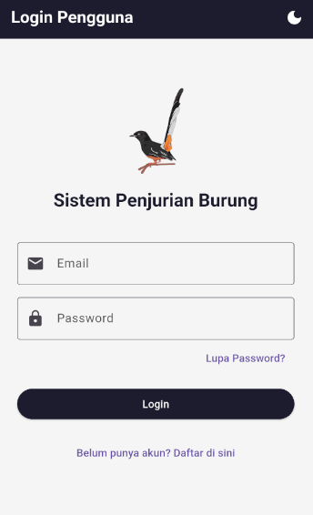
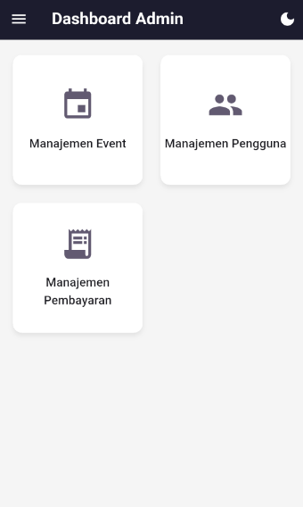
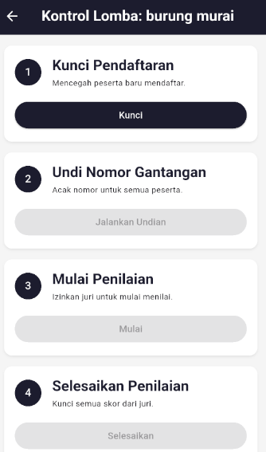
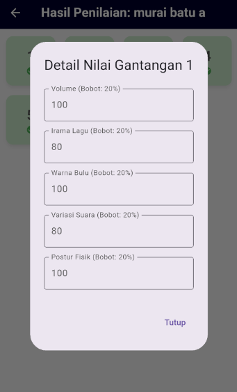
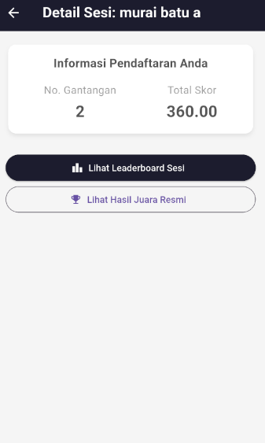

# Sistem Penjurian Burung v1.0


Aplikasi mobile **Full-Service** untuk manajemen lomba burung kicau, dibangun dengan Flutter dan Firebase. Proyek ini mendigitalisasi seluruh alur kerja event, mulai dari persiapan, pendaftaran peserta, hingga penilaian real-time oleh juri dan finalisasi hasil, semuanya dapat dikelola dari dalam satu aplikasi.

---

## Tampilan Aplikasi

| Login & Verifikasi | Dashboard Admin | Kontrol Lomba (Admin) |
| :---: | :---: | :---: |
|  |  |  |
| **Panel Juri** | **Detail Sesi (Peserta)** | **Hasil Akhir** |
|  |  |  |

---

## Fitur Utama

### Untuk Administrator
- **Manajemen Event & Sesi (CRUD):** Kontrol penuh untuk membuat, mengedit, dan menghapus event serta sesi di dalamnya.
- **Kustomisasi Sistem Penilaian:** Sistem penilaian dibuat secara numerik (tidak menggunakan nominasi) dimana admin **mengatur kriteria penilaian (misal: Irama, Volume) dan bobotnya** untuk setiap sesi.
- **Manajemen User:** Admin memiliki kontrol akun untuk mengubah, menghapus dan membuat Juri/Admin baru.
- **Panel Kontrol Lomba Real-Time:** Saat hari-H lomba admin mengatur jalan kegiatan lomba dengan panel kegiatan yang terstruktur:
  1.  **Kunci Pendaftaran**
  2.  **Undi Nomor Gantangan**
  3.  **Mulai Penilaian**
  4.  **Selesaikan Penilaian**
  5.  **Finalisasi Hasil Juara**
- **Manajemen Pembayaran Manual:** Panel khusus untuk **mengonfirmasi bukti transfer** yang diunggah peserta dan melihat riwayat pembayaran.
- **Export Laporan ke Excel:** Membuat dan membagikan laporan hasil juara dalam format `.xlsx` langsung dari aplikasi.

### Untuk Juri
- **Dashboard Tugas:** Menampilkan daftar sesi yang spesifik ditugaskan kepadanya.
- **Panel Penjurian:**
  - Form input skor **otomatis menyesuaikan** dengan kriteria yang diatur Admin.
  - Kemampuan untuk **mengedit/merevisi skor** selama sesi masih berlangsung.
  - Panel berubah menjadi mode **read-only** setelah sesi selesai.

### Untuk Peserta
- **Alur Pendaftaran & Pembayaran:**
  - Mendaftar dan mendapatkan halaman instruksi pembayaran dengan **nominal dan kode unik**.
  - Mengunggah bukti transfer melalui **Cloudinary**.
- **Halaman Detail Sesi:** Setelah lunas, peserta dapat mengakses halaman khusus yang menampilkan **Nomor Gantangan** dan **Total Skor** mereka.

---

## Arsitektur & Teknologi

- **Framework:** Flutter
- **Manajemen State:** Riverpod
- **Backend & Database:** Google Firebase
  - **Authentication:** Manajemen pengguna, verifikasi email, reset password.
  - **Cloud Firestore:** Database NoSQL untuk semua data aplikasi.
- **Penyimpanan File:** Cloudinary (untuk upload bukti pembayaran).
- **Laporan:** `excel`, `path_provider`, `share_plus`.
- **Keamanan:** `flutter_dotenv` untuk environment variables.

---

## Setup & Instalasi

1.  **Clone Repositori**
    ```bash
    git clone [https://github.com/username/nama-repo.git](https://github.com/username/nama-repo.git)
    cd nama-repo
    ```

2.  **Setup Firebase**
    - Buat proyek baru di [Firebase Console](https://console.firebase.google.com/).
    - Ikuti instruksi untuk menambahkan aplikasi Flutter ke proyek Firebase Anda.
    - Unduh file `firebase_options.dart` yang dihasilkan dan letakkan di dalam folder `lib/`.
    - Aktifkan **Authentication (Email/Password)** dan **Cloud Firestore** di konsol.

3.  **Setup Cloudinary**
    - Buat akun gratis di [Cloudinary](https://cloudinary.com).
    - Dapatkan **Cloud Name** Anda dari dashboard.
    - Buat sebuah **Upload Preset** dengan mode `Unsigned`.

4.  **Konfigurasi Environment Variables**
    - Di root proyek, buat file bernama `.env`.
    - Isi file tersebut dengan format berikut:
      ```
      CLOUDINARY_CLOUD_NAME="NAMA_CLOUD_ANDA"
      CLOUDINARY_UPLOAD_PRESET="NAMA_UPLOAD_PRESET_ANDA"
      ```
    - **PENTING:** Pastikan file `.env` sudah ditambahkan ke dalam `.gitignore` Anda.

5.  **Jalankan Aplikasi**
    ```bash
    flutter pub get
    flutter run
